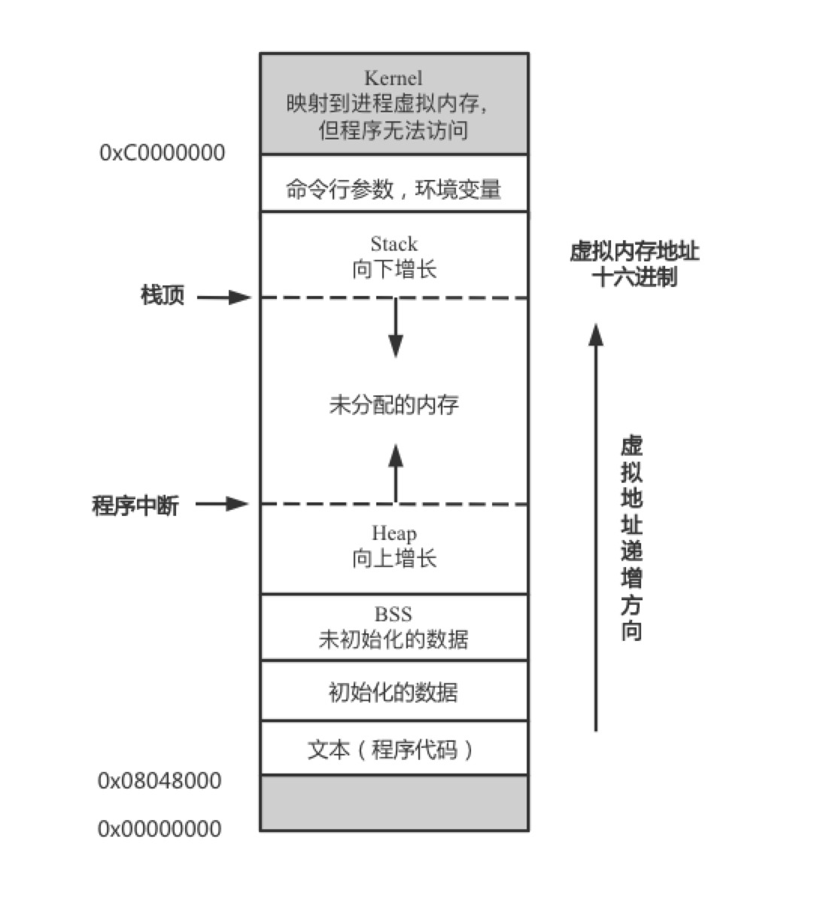

# 10.13 内存分布

## 回顾Linux进程的虚拟内存

我们编写的程序都运行在计算机的内存（一般指的是计算机的随机存储器`RAM`），`UNIX`环境内存的大致分布如下：

> 当应用程序被加载到内存空间中执行时，操作系统负责代码段、数据段和`BSS`段的加载，并在内存中为这些段分配空间。在程序运行期间，栈段也交给操作系统进行管理，只有堆段是程序员自行管理（可显式地申请和释放空间）的内存区域。

* 代码段`Text Segment`：存放程序执行代码的一段内存区域，这部分区域的大小在程序运行前就已经确定，并且内存区域通常属于只读（不过某些架构也允许修改程序）。代码段中的指令包含操作码和被操作对象（或对象地址引用）。只读常量将直接包含在代码段中；局部变量会在栈区分配内存空间并引用；全局变量会引用`BSS`段和数据段中的地址。
* 数据段`Data Segment`：静态内存分配，存放静态变量、初始化的全局变量和常量。
* `BSS`段：静态内存分配，包含了程序中未初始化的全部变量，在内存中`BSS`段全部置零。
* 堆`heap`：动态内存分配，当进程调用`malloc`等函数分配内存时，堆会扩张用于存放新申请的变量，使用`free`等函数释放内存时，被释放的内存从堆中剔除。
* 栈`stack`：存放程序的局部变量，即在函数括弧`{}`中定义的变量。除此之外，在函数被调用时参数会被压入栈中，函数调用结束后函数的返回值也会被存放在栈中。另外，栈具有先进先出的特点，经常用于保存/恢复调用现场，这也是我们在程序`crash`时打印`stack`的原因。

## C++内存分布

C++中内存被分为如下几个区域：

* 栈`stack`：由编译器分配释放，存放函数的参数值和局部变量的值等
* 堆`heap`：操作系统维护的一块可供动态分配的特殊内存，程序运行时调用`malloc()`从堆上申请内存，调用`free()`返还内存
* 自由存储区`free store`：一般由程序员主动申请（new）和释放（delete），如果程序员忘记释放申请的内存则可能存在内存泄漏，这些内存只能等到程序结束后被操作系统自动回收
* 全局/静态存储区：存放全局变量和静态变量
* 常量存储区：存放不允许修改的常量（不过也可以通过非正当手段修改）
* 程序代码区：存储函数体（类的成员函数和全局函数）的二进制代码

#### 2. 自由存储区free store和堆heap的区别

很多编译器的`new`和`delete`都是通过`malloc`和`free`来实现的，那么有一个问题：

> Q：以`malloc`实现的`new`，所申请的内存是在堆上还是在自由存储区上？

* 堆：C语言和操作系统的术语，指的是操作系统维护的一块提供动态分配功能的特殊内存（可以通过`malloc`和`free`来动态地申请和释放内存）
* 自由存储区：C++的术语，指的是通过`new`和`delete`动态分配和释放内存的内存区域

> A：C++编译器默认使用堆来实现自由存储，即缺省的全局运算符`new`和`delete`是通过`malloc`和`free`来实现的。这时候以`malloc`实现的`new`既可以说是在堆上也可以说在自由存储区上（前者是具象的概念，后者是抽象的概念）。不过程序员可以通过重载`new`操作符来使用其他内存实现自由存储，此时自由存储区和堆就不是同一个概念了。

#### 3. 堆和栈的区别

|          | 堆             | 栈             |
| -------- | -------------- | -------------- |
| 管理方式 | 编译器自动管理 | 程序员手动控制 |
| 空间大小 |                |                |
|          |                |                |

#### 4. 静态内存、栈内存和堆

* 静态内存：用于保存局部`static`、类`static`数据成员和定义在任何函数之外的变量
* 栈内存：保存定义在函数内的非`static`对象

分配在静态内存或者栈内存的对象由编译器自动创建和销毁，对于栈对象仅在其定义的程序块运行时才存在，`static`对象在使用之前分配，在程序结束时销毁。

C++程序还拥有一个内存池（被称为自由空间`free store`或者堆`heap`，两者的区别在前面已经描述了），程序用内存池来存储动态分配的对象，当动态对象不再使用时，我们的代码必须显式销毁他们。

## Reference

[1] https://chenqx.github.io/2014/09/25/Cpp-Memory-Management/

[2] https://www.cnblogs.com/QG-whz/p/5060894.html