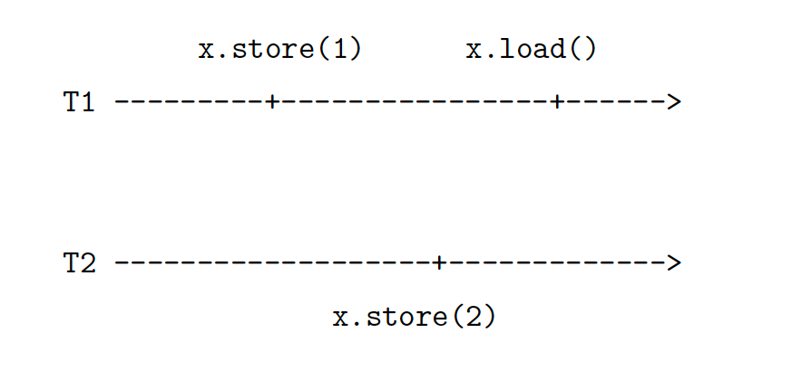
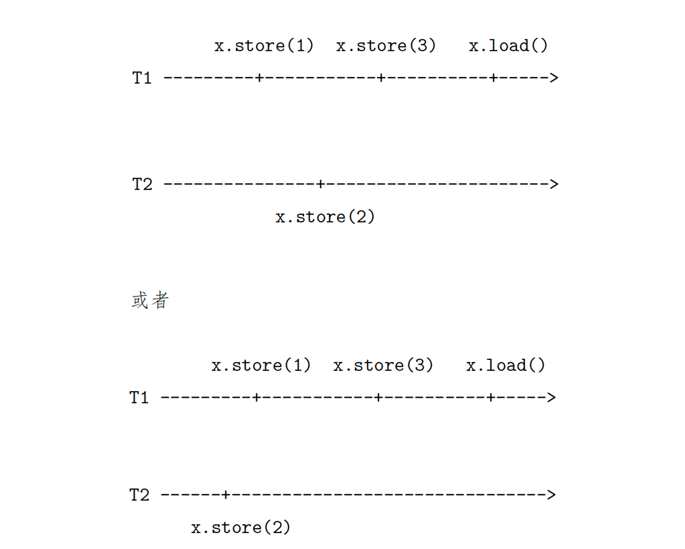

# 10.9 并行和并发

## 并行基础

`std::thread`用于创建一个执行的线程实例，它是一切并发编程的基础，使用时需要包含`<thread>`头文件，它提供了很多基本的线程操作，比如`get_id()`用于获取所创建线程的线程ID，使用`join()`来加入一个线程等。

```c++
#include <iostream>
#include <thread>

int main() {
    std::thread t([]() {
        std::cout << "tomocat" << std::endl;
    });
    t.join();
    return 0;
}
```

## 互斥量和临界区

C++11引入了`mutex`相关的类，其所有相关的函数都放在`<mutex>`头文件中。`std::mutex`是C++11中最基本的`mutex`类，通过实例化`std::mutex`可以创建互斥量，而通过其成员函数`lock()`可以进行上锁，`unlock()`可以进行解锁。在实际编写代码的过程中，最好不要去直接调用成员函数，因为需要在每个临界区的出口处（以及任何可能抛出异常的地方）调用`unlock()`。C++11为互斥量提供了一个RAII语法的模板类`std::lock_guard`，可以在确保代码整洁性的同时保证代码的异常安全性。

在RAII语法下，对于临界区的互斥量的创建只需要在作用域的开始部分，例如：

```c++
#include <iostream>
#include <mutex>
#include <thread>

int v = 1;

void critical_section(int change_v) {
    static std::mutex mtx;
    std::lock_guard<std::mutex>lock(mtx);

    // 执行竞争操作
    v = change_v;

    // 离开作用域后mtx会被释放
}

int main() {
    std::thread t1(critical_section, 2), t2(critical_section, 3);
    t1.join();
    t2.join();

    std::cout << "v:" << v << std::endl;
    return 0;
}
```

由于C++保证了所有栈对象在声明周期结束时会被销毁，所以这样的代码也是异常安全的。无论`critical_section`正常返回、还是在中途抛出异常，都会引发堆栈回退，也就自动调用了`unlock()`。与`std::lock_guard`相比，`std::unique_lock`更加灵活，`std::unique_lock`的对象会以独占所有权（没有其他的`unique_lock`对象同时拥有某个`mutex`对象的所有权）的方式管理`mutex`对象上的上锁和解锁操作。所以在并发编程中推荐使用`std::unique_lock`。

> `std::unique_lock`可以在声明后的任意位置显式调用`lock`和`unlock`，相比于`std::lock_guard`可以缩小锁的作用范围，提供更高的并发度。

如果你用到了条件变量`std::condition_variable::wait`则必须使用`std::unique_lock`作为参数，例如：

```c++
#include <iostream>
#include <mutex>
#include <thread>

int v = 1;

void critical_section(int change_v) {
    static std::mutex mtx;
    std::unique_lock<std::mutex>lock(mtx);

    // 执行竞争操作
    v = change_v;
    std::cout << "v:" << v << std::endl;
    // 提前释放锁, 提高并发度
    lock.unlock();

    // 在此期间任何人都可以抢夺v的持有权

    // 开始另一组竞争操作, 再次加锁
    lock.lock();
    v += 1;
    std::cout << "v:" << v << std::endl;
}

int main() {
    std::thread t1(critical_section, 2), t2(critical_section, 3);
    t1.join();
    t2.join();
    return 0;
}
```

`c++11`提供了如下的4种互斥量，需要包含头文件`#include <mutex>`

```bash
std::mutex                  // 独占的互斥量，不能递归使用
std::timed_mutex            // 超时的互斥量，不能递归使用
std::recursive_mutex        // 递归互斥量，不带超时功能
std::recursive_timed_mutex  // 带超时的递归互斥量
```

#### 1. std::mutex

* 用`lock`和`unlock`进行独占，此时要保证锁被正确释放，如`lock`和`unlock`之间程序异常而退出，则会导致死锁等问题
* 用`try_lock`可以尝试获得锁，返回`bool`值
* 可以用`lock_guard`简化`lock`和`unlock`写法，这种写法更加安全，可以保证出了作用域之后锁被释放

```c++
#include<iostream>
#include<thread>
#include<chrono>
#include<mutex>

std::mutex g_lock;

void f() {
    g_lock.lock();
    
    std::cout << "entered thread" << std::this_thread::get_id() << std::endl;
    std::this_thread::sleep_for(std::chrono::seconds(1));
    std::cout << "leaving thread" << std::this_thread::get_id() << std::endl;
    
    g_lock.unlock(); 
}

void f2() {
    std::lock_guard<std::mutex> locker(g_lock);     
    std::cout << "entered thread" << std::this_thread::get_id() << std::endl;
    std::this_thread::sleep_for(std::chrono::seconds(1));
    std::cout << "leaving thread" << std::this_thread::get_id() << std::endl;

}
int main() {    
    std::thread threads[6];
    
    for(int i = 0; i < 3; i++)threads[i] = std::thread(f);

    for(int i = 3; i < 6; i++)threads[i] = std::thread(f2);
    
    for(int i = 0; i < 6; i++)threads[i].join();
} 
```

输出：

```c++
entered thread0x70000c99b000
leaving thread0x70000c99b000
entered thread0x70000ca1e000
leaving thread0x70000ca1e000
entered thread0x70000caa1000
leaving thread0x70000caa1000
entered thread0x70000cb24000
leaving thread0x70000cb24000
entered thread0x70000cba7000
leaving thread0x70000cba7000
entered thread0x70000cc2a000
leaving thread0x70000cc2a000
```

#### 2. std::recursive_mutex

* 当同一个线程多次获取锁时，使用`mutex`会造成死锁，`std::recursive_mutex`允许同一个线程多次获取锁
* 不建议使用递归互斥量，因为它的效率比较低，而且应用场景可以通过优化来避免。当获取达到一定的次数后会抛出`std::system`错误


```c++
#include<iostream>
#include<thread>
#include<chrono>
#include<mutex>
template<typename T>
struct Test {
    //std::mutex mutex; //死锁 
    T mutex; 
    
    void A(int x) {
        std::lock_guard<T> lock(mutex);
        std::cout << 1 << std::endl; 
    } 
    void B(int y) {
        std::lock_guard<T> lock(mutex);
        std::cout << 2 << std::endl;
     }
    void C(int x, int y) {
        std::lock_guard<T> lock(mutex);
        A(x);
        B(y);
    }
};


int main() {    
    Test<std::mutex> test;
    Test<std::recursive_mutex> test2;
    //test.C(23,32); //这个会发生死锁 
    test2.C(23,32);
} 
```

输出：

```c++
1
2
```

#### 3. 带超时的互斥量`std::timed_mutex`和`std::recursive_timed_mutex`

* `std::timed_mutex`是带超时的独占锁
* `std::recursive_timed_mutex`是带超时的递归锁

```c++
#include<iostream>
#include<thread>
#include<chrono>
#include<mutex>

std::timed_mutex mutex;


void work(int _timeout, int _sleepDuration) {
    std::chrono::milliseconds timeout(_timeout);
    std::chrono::milliseconds sleepDuration(_sleepDuration);
    
    while(1) {
        if(mutex.try_lock_for(timeout)) {
            std::cout << std::this_thread::get_id() << ":get lock" << std::endl;
            std::this_thread::sleep_for(sleepDuration);
            mutex.unlock();
        } else {
            std::cout << std::this_thread::get_id() << ":fail to get lock" << std::endl;
            std::this_thread::sleep_for(sleepDuration);
        
        }
    }
}

int main() {    
    std::thread t1(work, 500, 300);
    std::thread t2(work, 500, 300);
    
    t1.join();
    t2.join();
    
} 
```

## 期物Future

`std::future`提供了一个访问异步操作结果的途径。

举个例子：试想一下我们的主线程A希望开辟一个线程B去异步执行某个任务，并在某个特定的时间点获得B的结果。在C++11的`std::future`被引入之前，通常的做法是：创建一个线程A，在线程A里启动任务B，当准备完毕后发送一个事件并将结果保存在全局变量中。主线程A可以接着处理其他的事情，当需要结果的时候，调用一个线程等待函数来获得执行的结果。而C++11提供的`std::future`简化了这个流程，可以用来获取异步任务的结果：

```c++
#include <iostream>
#include <future>
#include <thread>

int main() {
    // 将一个返回值为7的lambda表达式封装到task中
    // std::packaged_task的模板参数为要封装函数的类型
    std::packaged_task<int()> task([](){ return 7; });

    // 在一个线程中执行task, 调用wait()阻塞直到期物完成
    std::future<int> result = task.get_future();
    std::thread(std::move(task)).detach();
    std::cout << "waiting...";
    result.wait();

    // 输出执行结果
    std::cout << "done!" << std::endl << "future result is " << result.get() << std::endl;
    return 0;
}
```

## 条件变量

#### 1. 简介

条件变量是并发编程的一种同步机制，并且几乎总是和互斥量一起使用的，它可以使得线程一直阻塞直到某个条件发生后再继续执行。条件变量是在多线程中实现“等待->唤醒”逻辑的常用方法，主要包含两个动作：

* 一个线程等待条件变量的条件成立而挂起
* 另一个线程负责使条件成立

> Tips：条件变量本身并不包含条件，因为它通常与`if`或者`while`同时使用，所以才被称为条件变量。

#### 2. 有互斥锁后还需要条件变量的原因

并发编程有两大需求，一是互斥（线程间存在共享数据），一是等待（线程间存在依赖）。互斥可以通过互斥量实现，等待则需要条件变量来实现。考虑一下生产者和消费者模型，其中生产者和消费者各是一个队列，消费者线程依赖生产者线程`push`元素进入任务队列。假设没有条件变量，那么消费者需要一直加锁轮询队列，在队列已经为空时是相当耗费性能的。有了条件变量后我们就可以用事件模式了：消费者线程发现队列为空后就告诉操作系统自己需要`wait`直到生产者线程发信号来唤醒自己。

对比一下两种方式：

* 加锁轮询队列：性能较差（消耗cpu）
* 事件模式：性能不会太差（存在切换上下文的开销）

#### 3. 实例

下面是一个生产者和消费者的例子：

```c++
#include <iostream>
#include <queue>
#include <mutex>
#include <condition_variable>
#include <thread>
#include <chrono>

int main() {
    std::queue<int> produced_nums;
    std::mutex mtx;
    std::condition_variable cv;
    bool notified = false;  // 通知信号

    // 生产者
    auto producer = [&]() {
        for (int i = 0; ; i++) {
            std::this_thread::sleep_for(std::chrono::milliseconds(900));
            std::unique_lock<std::mutex> lock(mtx);
            std::cout <<  "producing " << i << std::endl;
            produced_nums.push(i);
            notified = true;
            cv.notify_all();  // 生产者线程每次push元素都通知消费者线程(此处也可以用notify_one)
        }
    };

    // 消费者
    auto consumer = [&]() {
        while (true) {
            std::unique_lock<std::mutex> lock(mtx);
            while (!notified) {  // 避免虚假唤醒
                cv.wait(lock);
            }
            // 短暂取消锁, 使得生产者有机会在消费者消费空前继续生产
            lock.unlock();
            std::this_thread::sleep_for(std::chrono::milliseconds(1000));  // 消费者慢于生产者
            lock.lock();
            while (!produced_nums.empty()) {
                std::cout << "consuming " << produced_nums.front() << std::endl;
                produced_nums.pop();
            }
            notified = false;
        }
    };

    // 分别在不同的线程中运行
    std::thread p(producer);
    std::thread cs[2];
    for (int i = 0; i < 2; ++i) {
        cs[i] = std::thread(consumer);
    }
    p.join();
    for (int i = 0; i < 2; ++i) {
        cs[i].join();
    }
    return 0;
}
```

## 原子操作

现在CPU体系结构提供了CPU指令级的原子操作，因此提供了C++11中多线程并发读写共享变量另一个思路。`std::atomic`模板可以实例化一个原子类型，将一个原子类型读写操作从一组指令最小化到单个CPU指令，例如：

```c++
#include <atomic>
#include <thread>
#include <iostream>

std::atomic<int> count = {10};

int main() {
    std::thread t1([](){
        count.fetch_add(1);
    });
    std::thread t2([](){
        count++;     // 等价于fetch_add
        count += 1;  // 等价于fetch_add
    });
    t1.join();
    t2.join();
    std::cout << count << std::endl;
    return 0;
}
```

当然，并非所有的类型都能提供原子操作，这是因为原子操作的可行性取决于CPU的架构以及实例化的类型结构是否满足该架构对内存对齐条件的要求。我们可以通过`std::atomic<T>::is_lock_free`来检查该原子类型是否支持原子操作：

```c++
#include <atomic>
#include <iostream>

struct A {
    float x;
    int y;
    long long z;
};

int main() {
    std::atomic<A> a;
    // 需要链接-latomic
    std::cout << std::boolalpha << a.is_lock_free() << std::endl;
    return 0;
}

// 输出:
true
```

## 一致性模型

如果我们强行将一个变量`v`在多个线程之间的操作设为原子操作（比如加锁），即任何一个线程在操作完`v`后其他线程均能同步感知到`v`的变化。则对于`v`而言表现为顺序执行的程序，它并没有由于引入多线程而得到任何效率上的收益。对此有什么办法可以适当地加速呢？答案便是削弱原子操作在进程间的同步条件。

从原理上看，每个线程可以对应为一个集群节点，而线程间的通信也几乎等价于集群节点间的通信。削弱进程间的同步条件，通常会考虑四种不同的一致性模型：

#### 1. 线性一致性

线性一致性又称强一致性或原子一致性，它要求任何一次读操作都能读到某个数据的最近一次写的数据，并且所有线程的操作顺序与全局时钟下的顺序是一致的。



在这种情况下`T1`和`T2`对`x`的两次写操作时原子的，且`x.store(1)`是严格发生在`x.store(2)`之前，`x.store(2)`是严格发生在`x.load()`之前。值得一提的是，线性一致性对全局时钟的要求是难以实现的，这也是人们不断研究比这个一致性更弱条件下其他一致性算法的原因。

#### 2. 顺序一致性

顺序一致性同样要求任何一次读操作都能读到数据最近一次写入的数据，但未要求与全局时钟的顺序一致。



在顺序一致性的要求下，`x.load()`必须读到最近一次写入的数据，因此`x.store(2)`与`x.store(1)`并无任何先后保障，即只要`T2`的`x.store(2)`发生在`x.store(3)`之前即可。

#### 3. 因果一致性

因果一致性的要求进一步降低，只需要有因果关系的操作顺序得到保障，而非因果关系的操作顺序则不作要求。

上面给出的三个例子都是属于因果一致性的，因为整个过程只有对和产生依赖，而和在此例子中表现为没有关系（虽然实际情况中我们需要更详细的信息才能确定和确实无关）。

#### 4. 最终一致性

最终一致性是最弱的一致性要求，它只保障某个操作在未来的某个时间点上会被观察到，但并非要求被观察到的时间。因此我们甚至可以对此条件稍作加强，例如规定某个操作被观察到的时间总是有界的。

在上面的情况中，如果我们假设`x`的初始值为`0`，则`T2`中四次`x.read()`结果可能但不限于以下情况：

```bash
3 4 4 4  // x的写操作被很快观察到
0 3 3 4  // x的写操作被观察到的时间存在一定延迟
0 0 0 4  // 最后一次读操作读到了x的最终值, 但此前的变化未被观察到
0 0 0 0  // 在当前时间段内x的写操作均未被观察到，但未来某个时间点上一定能观察到x为4的情况
```

## 内存顺序

#### 1. 简介

内存顺序描述了计算机CPU获取内存的顺序，内存排序极可能发生在编译器编译期间，也可能发生在CPU指令执行期间。为了尽可能提高程序性能，编译器和CPU会对指令重新排序，并且现代CPU拥有多级cache，这些都可能导致多个线程观察到的变量修改顺序不一致。比如下面这个例子：

```c++
#include <thread>
#include <iostream>

int main() {
    // a和b均初始化为0
    int a = 0, b = 0;

    std::thread t1([&](){
        a = 42;
        b = 1;
    });

    std::thread t2([&](){
        while (true) {
            if (b == 1) {
                std::cout << a << std::endl;  // 可能输出0或者42, 取决于内存顺序
                break;
            }
        }
    });

    t1.join();
    t2.join();

    return 0;
}
```

在上面的例子中，线程`t2`输出`a`的值既有可能是0也有可能是42，这取决于内存顺序。原子操作涉及两个含义：

* 原子操作不可分
* 原子操作是多个线程之间的一个同步点（执行原子操作时会对原子操作前后的内存进行一些必要的同步，从而影响这些操作在不同线程之间的可见情况）

至于哪些操作会在多线程间同步，取决于我们指定的内存顺序。

#### 2. 内存顺序

C++的内存模型规定了6种内存顺序，每种内存顺序要求同步的操作都不一样（当然对性能的影响也不一样），并且有些内存顺序是可以/需要配合使用的。

###### 2.1 memory_order_relaxed

只保证原子操作的原子性，不影响这个同步点前后的内存操作。这是原子操作中最宽松的内存顺序，无法解决上述例子的同步问题。

###### 2.2 memory_order_acquire

> Tips：`memory_order_acquire`和`memory_order_release`往往配合使用。

提供`read acquire`语义，适用于` atomic load`操作。从执行`read acquire`的线程来看，`read acquire `语意会阻止原子操作之后的所有读和写被重排到原子操作之前。

```c++
A.load(std::memory_order_acquire);
B = 42;  // 不可能被重排到A.load(std::memory_order_acquire)之前
```

###### 2.3 memory_order_release

提供`write release `语义，适用于`atomic store`操作。从执行`write release`的线程来看，`write release`语意会阻止原子操作之前的所有读和写被重排到原子操作之后。

```c++
B = 42;  // 不可能被乱序到A.store(1, std::memory_order_release)之后
A.store(1, std::memory_order_release);
```

回到一开始的例子，使用`release-acquire`语义可以保证线程`t2`观察到`b`变成1时，能观察到`a`变成42。

```c++
#include <thread>
#include <iostream>
#include <atomic>

int main() {
    // a和b均初始化为0
    int a = 0;
    std::atomic<int> b = {0};

    std::thread t1([&](){
        a = 42;
        b.store(1, std::memory_order_release);  // 对a赋值42不可能被重排到b.store()之后
    });

    std::thread t2([&](){
        while (true) {
            if (b.load(std::memory_order_acquire) == 1) {
                std::cout << a << std::endl;   // 必定输出42
                break;
            }
        }
    });

    t1.join();
    t2.join();

    return 0;
}
```

###### 2.4 memory_order_consume

同样作用于`atomic load`操作，但是`memory_order_consume`语义弱于`memory_order_acquire`。从执行`read consume`的线程来看，`read consume`语义会阻止原子操作之后有依赖关系的读写操作被重排到原子操作之前。（对比一下，`read acquire`是阻止原子操作之后所有的读写操作被重排到原子操作之前）

> Tips：根据`cppreference`的文档说明，不鼓励使用`memory_order_consume`这个内存顺序：
>
> The specification of release-consume ordering is being revised, and the use of memory_order_consume is temporarily discouraged.(since C++17)

###### 2.5 memory_order_acq_rel

对一个`load-modify-store`的原子操作施加`read acquire`和`write release`的内存顺序限制，比如`fetch_add`。

###### 2.6 memory_order_seq_cst

`memory_order_seq_cst`是最严格的内存顺序：

* 对于`atomic_load`会执行`acquire`语义
* 对于`atomic store`会执行`release`语义
* 对于`load-modify-store`会执行`acquire-release`语义

除此之外，它还保证所有线程观察到的所有原子变量的修改顺序是一致的。

## 内存模型

为了追求极致的性能，实现各种强度要求的一致性，C++11为原子操作定义了六种不同的内存顺序`std::memory_order`选项，表达了四种多线程间的同步模型。

#### 1. 宽松模型

宽松模型通过`std::memory_order_relaxed`指定，在此模型下单个线程内的原子操作都是顺序执行的，不允许指令重排，但不同线程间原子操作的顺序是任意的。

#### 2. 释放/消费模型

在此模型中，我们开始限制进程间的操作顺序，如果某个线程需要修改某个值，但另一个线程会对该值的某次操作产生依赖，即后者依赖前者。具体而言，线程A完成了三次对`x`的写操作，线程B仅依赖其中第三次`x`的写操作，与`x`的前两次写行为无关，则当A主动执行释放`x`的时候（使用`std::memory_order_release`），选项`std::memory_order_consume`能够确保B在调用`x.load()`时候观察到A中第三次对`x`的写操作。

```c++
#include <atomic>
#include <vector>
#include <thread>
#include <iostream>

int main() {
    // 初始化为nullptr防止consumer线程读取野指针
    std::atomic<int*> ptr(nullptr);
    int v;

    std::thread producer([&](){
        int *p = new int(42);
        v = 1024;
        ptr.store(p, std::memory_order_release);
    });

    std::thread consumer([&](){
        int *p;
        while (!(p = ptr.load(std::memory_order_consume))) {}
        std::cout << "p: " << *p << std::endl;
        std::cout << "v: " << v << std::endl;
    });
    producer.join();
    consumer.join();
}
```

#### 3. 释放/获取模型

在此模型下，我们可以进一步加紧对不同线程间原子操作的顺序的限制，在释放`std::memory_order_release`和获取`std::memory_order_require`之间规定时序，即发生在释放操作之前的所有写操作，对其他线程的任何获取操作都是可见的。

```c++
#include <atomic>
#include <vector>
#include <thread>
#include <iostream>

int main() {
    std::vector<int> v;
    std::atomic<int> flag = {0};
    std::thread release([&](){
        v.push_back(42);
        flag.store(1, std::memory_order_release);  // write release保证v.push_back(42)肯定执行成功
    });

    std::thread acqrel([&](){
        // compare_exchange_strong: 将this值与expect比较, 相等则改成desire值并返回true, 否则返回false
        int expected = 1;  // must before compare_exchange_strong
        while (!flag.compare_exchange_strong(expected, 2, std::memory_order_acq_rel)) {
            expected = 1;  // must after compare_exchange_strong
        }
        // flag has changed to 2
    });

    std::thread acquire([&](){
        while (flag.load(std::memory_order_acquire) < 2) {}
        std::cout << v.at(0) << std::endl;  // must be 42
    });

    release.join();
    acqrel.join();
    acquire.join();
}
```

#### 4. 顺序一致模型

顺序一致模型下原子操作满足顺序一致性，进而可能对性能产生损耗。可以显式通过`std::memory_order_seq_cst`进行指定：

```c++
#include <thread>
#include <iostream>
#include <atomic>
#include <vector>

int main() {
    std::atomic<int> counter = {0};
    std::vector<std::thread> vt;
    for (int i = 0; i < 100; ++i) {
        vt.emplace_back([&](){
            counter.fetch_add(1, std::memory_order_seq_cst);
        });
    }
    for (auto &t : vt) {
        t.join();
    }
    std::cout << "current counter:" << counter << std::endl;
}
```

## Reference

[1] https://www.jianshu.com/p/01ad36b91d39

[2] https://punmy.cn/categories/Code/

[3] https://www.zhihu.com/question/68017337/answer/796332672

[4] https://zhuanlan.zhihu.com/p/45566448


